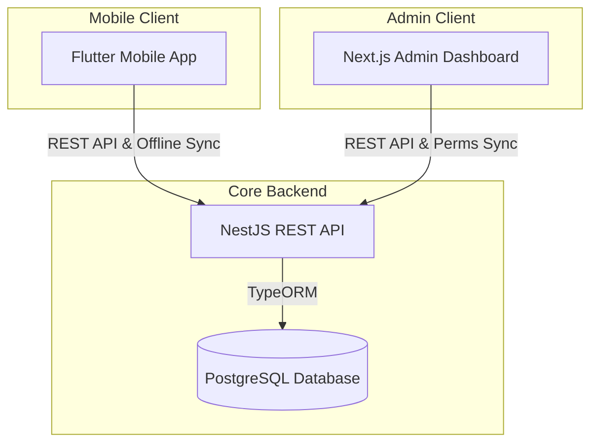
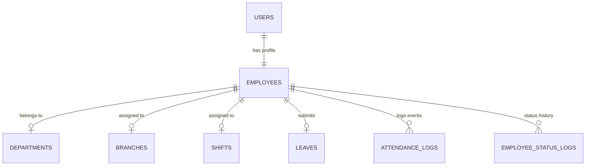
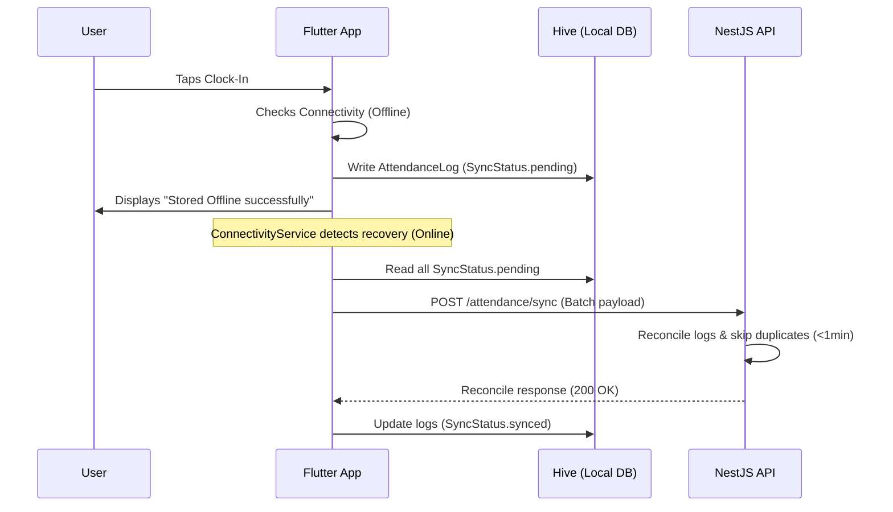

# TK Clocking System — Project Architecture Walkthrough

The **TK Clocking System** is a production-grade, multi-tenant, **Ghana-Ready Workforce Time & Attendance SaaS** platform. It comprises a NestJS REST API, a Next.js Admin Dashboard, and an offline-first Flutter mobile application. The entire stack is optimized for low-bandwidth conditions, strict geographic validation (GPS geofencing), and local operational calendars.

---

## 📦 Monorepo Architecture Overview

The codebase is organized as a monorepo featuring three main tiers:



---

## 🗄️ Database Schema & Entities

The system uses **PostgreSQL** managed by **TypeORM** on the backend. The core entity relationships are mapped below:



### 1. `User` Entity ([user.entity.ts](file:///d:/source_codes/school_clocking_system/backend/src/modules/users/user.entity.ts))
- Core authentication profile.
- Roles: `employee`, `supervisor`, `hr_admin`, `super_admin`.
- Stores basic fields: `fullName`, `email`, `phone`, `username`, `password` (bcrypt hashed), `fcmToken` (push notification target).

### 2. `Employee` Entity ([employee.entity.ts](file:///d:/source_codes/school_clocking_system/backend/src/modules/employees/employee.entity.ts))
- Profile details linked `1:1` with `User`.
- Links to `Branch` (geofence), `Department` (org), and `Shift` (schedule).
- Status field (`active`, `inactive`, `suspended`) maps with `statusChangeDate` for automatic end-of-service compliance in reporting.

### 3. `AttendanceLog` Entity ([attendance-log.entity.ts](file:///d:/source_codes/school_clocking_system/backend/src/modules/attendance/attendance-log.entity.ts))
- Records single events (clock-in, clock-out, break-in, break-out).
- Lat/Lng stored as high-precision decimals (`numeric(10,8)` / `numeric(11,8)`).
- Audit trails flags: `isOfflineSync`, `isAdminOverride`, `adminOverrideName`, `adminNote`.

---

## 🛠️ Backend Architecture (NestJS)

### 1. Ghana-Timezone Enforcement
To avoid cloud deployment date shift errors (UTC drift), the application forces its process environment to the Ghana timezone at the earliest boot line inside [main.ts](file:///d:/source_codes/school_clocking_system/backend/src/main.ts):
```typescript
process.env.TZ = process.env.APP_TIMEZONE || 'Africa/Accra';
```

### 2. Dynamic Settings & Permission Matrix
Instead of hardcoding roles and endpoints, permissions are saved in the database under a global `role_permissions` key in the `settings` table. 
- **`PermissionsGuard` ([permissions.guard.ts](file:///d:/source_codes/school_clocking_system/backend/src/modules/auth/guards/permissions.guard.ts))**:
  - Dynamically fetches the current permissions JSON from the settings service.
  - Matches the client's JWT role against the permissions matrix.
  - Grants instant, non-deployment updates for RBAC parameters.
- **Super Admin Bypass**: The `super_admin` role automatically bypasses all validation checks (`return true`).

### 3. Health & Uptime Maintenance
To prevent free tier cloud instances (e.g. Render) from entering sleep cycles, the backend implements a clean, un-prefixed `/health` check in [main.ts](file:///d:/source_codes/school_clocking_system/backend/src/main.ts) targeted by uptime monitoring crons:
```typescript
app.use('/health', (req, res) => {
  res.status(200).send({
    status: 'ok',
    timestamp: new Date().toISOString(),
    timezone: process.env.TZ,
  });
});
```

---

## 🖥️ Web Admin Dashboard (Next.js)

The web dashboard is built using Next.js (utilizing v16 App Router conventions and React 19) styled with premium custom CSS custom properties (no rigid CSS frameworks).

### 1. Key Framework Choices
- **SWR (Stale-While-Revalidate)**: Used for data-fetching, ensuring extremely snappy user interactions by showing cached records while performing background updates. Auto-refreshes stats every 30 seconds for live pages.
- **Zustand**: Handles clean, light client auth state ([store.ts](file:///d:/source_codes/school_clocking_system/dashboard/src/lib/store.ts)) hydrated directly from localStorage.

### 2. Live Dashboard Statistics
Calculated dynamically based on active employee registration timelines:
- **Total Present**: Active clock-ins right now.
- **Late Arrivals**: Arrival timestamp past the shift start time + assigned grace period.
- **Absences**: Shift started, yet no clock-in recorded (filtered to exclude approved leave days, non-working holidays, and employees whose `hireDate` starts in the future).
- **Forgot Out**: Shift has completed, but no `clock_out` has been registered (detected 10 minutes post shift-end).

---

## 📱 Mobile App Architecture (Flutter)

The mobile application is a high-performance Flutter application built on standard **Clean Architecture** patterns, separating files into `data`, `domain`, and `presentation` layers.

```
lib/
├── core/
│   ├── constants/       # Global constants (e.g. AppConstants.baseUrl)
│   ├── di/              # GetIt Service Locator dependency injection
│   ├── network/         # ApiClient (Dio) with auto 401 logout interceptor
│   ├── router/          # GoRouter declaration
│   └── services/        # Location, Biometrics, Hive, and FCM Services
└── features/
    ├── attendance/      # Clock-in / Out screens + offline cache layer
    ├── auth/            # Login & profile operations
    └── leaves/          # Leave request pipeline
```

### 1. Offline-First Synchronization Protocol
When a connection drop occurs, the app gracefully switches to offline mode:



### 2. Geofence Distance Calculation
The backend coordinates GPS locations with the branch parameters using the **Haversine Formula** (which measures the great-circle distance between two points on a sphere in meters):
$$\Delta\text{lat} = \text{rad}(\text{lat}_2 - \text{lat}_1)$$
$$\Delta\text{lon} = \text{rad}(\text{lon}_2 - \text{lon}_1)$$
$$a = \sin^2\left(\frac{\Delta\text{lat}}{2}\right) + \cos(\text{rad}(\text{lat}_1)) \cdot \cos(\text{rad}(\text{lat}_2)) \cdot \sin^2\left(\frac{\Delta\text{lon}}{2}\right)$$
$$d = 2 \cdot R \cdot \text{atan2}\left(\sqrt{a}, \sqrt{1-a}\right)$$
*Where $R = 6,371,000$ meters.*
If $d > \text{branchAllowedRadius}$, clock-in is rejected with a descriptive message indicating the exact distance in meters from the designated geofenced radius boundary.

---

## ⚡ Core Business Logic State Machine ([AttendanceService.ts](file:///d:/source_codes/school_clocking_system/backend/src/modules/attendance/attendance.service.ts))

The backend applies strict state machine guards during attendance recording:

| Current Status | Target Event | Validations | Action |
| :--- | :--- | :--- | :--- |
| **Active** | `CLOCK_IN` | - No duplicate clock-in today.<br>- Timestamp falls within shift window (+/- 2h offset limit).<br>- Today is not a public holiday or weekend.<br>- Employee is not on approved leave. | **Clocked In** |
| **Clocked In** | `BREAK_IN` | - Must have clocked in first.<br>- Cannot already be on break.<br>- Cannot break after clocking out. | **On Break** |
| **On Break** | `BREAK_OUT` | - Must be on break (last log `BREAK_IN`).<br>- Must end break before clocking out. | **Clocked In** |
| **Clocked In** | `CLOCK_OUT` | - Must have clocked in first.<br>- Cannot clock out post-exit.<br>- Warning triggered if clocking out before shift-end. | **Shift Completed** |

---

## 🚨 Dynamic Home Page Banner Matrix

To inform employees, the Flutter app home page displays contextual banners at the very top based on their calendar and clock state:

| Status | Banner Message | Visual Styling |
| :--- | :--- | :--- |
| **Offline** | "No internet connection — working offline" | **Orange** (Global Alert) |
| **Unsynced** | "You have X pending offline record(s). Tap to sync." | **Orange Warning** |
| **Forgot Out** | "Forgot to Clock Out? You have been clocked in since yesterday." | **Red Alert** |
| **Late** | "You are Late! Please clock in as soon as possible." | **Orange Alert** |
| **Clocked In** | "Currently Clocked In" *(Live shift duration counter)* | **Green** (Success) |
| **Holiday** | "Enjoy your day off!" *(Displays holiday name)* | **Blue** (Info) |
| **Vacation / Leave**| "Enjoy your break!" *(Displays leave name)* | **Teal** (Info) |

