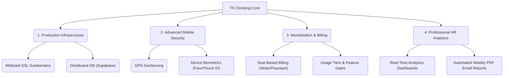

# 🌍 World-Class SaaS Production Readiness & Growth Roadmap

Your **TK Clocking** platform has successfully achieved a beautiful, fully functional **Multi-Tenant Foundation**. It isolates database records, white-labels subdomains, supports custom school branding, and white-labeled dashboards.

To elevate this to a **world-standard, professional enterprise SaaS product** that schools can subscribe to and pay for globally, here is the strategic roadmap of missing production keys and high-value upgrades.

---

---

## ☁️ 1. Production-Grade Cloud Infrastructure

Currently, your environment runs locally. To scale to thousands of schools, we must transition to a distributed cloud architecture.

### A. Wildcard DNS & Subdomains (`*.schoolclocking.com`)
*   **What is it**: Enables dynamic subdomains on the internet so that when a new school registers as `gis` (Ghana International School), they instantly get `https://gis.schoolclocking.com` with a secure SSL certificate without manual configuration.
*   **Implementation**:
    *   Deploy the React frontend on **Vercel** or **AWS Amplify** with **Wildcard DNS (`*.schoolclocking.com`)** enabled.
    *   Deploy NestJS on a containerized service (like **Render**, **Railway**, or **AWS ECS**) under an API domain (like `https://api.schoolclocking.com`).
    *   Utilize **Let’s Encrypt** or **Cloudflare** for automated dynamic SSL certificate issuance.

### B. Highly Available Database & File Storage
*   **What is it**: Move from a local PostgreSQL database to a secure, auto-backing, clustered database.
*   **Implementation**:
    *   Migrate production data to **Supabase** or **AWS RDS** (PostgreSQL) with daily automated backups.
    *   Configure **AWS S3** or **Supabase Storage** bucket folders partitioned by `tenantId` to safely host employee profile photos and school logos.

---

## 🔒 2. Professional Mobile Security & Anti-Fraud

When employees clock in on-site using the Flutter app, we must prevent "buddy clocking" (clocking in for a friend from home).

### A. GPS Geofencing
*   **What is it**: Automatically compares the employee's physical GPS coordinates with the school branch's designated coordinates.
*   **Upgrades**:
    *   Add `latitude`, `longitude`, and `allowedRadiusMeters` properties to the `Branch` entity.
    *   In the Flutter application, capture the user's location at the exact second they scan the QR code.
    *   Reject clock-ins if the employee is more than **100 meters** away from the branch coordinate.

### B. Device-Bound Fingerprint/Face Verification
*   **What is it**: Prompts the native OS biometrics (Face ID/Touch ID) on the employee's phone before displaying or processing the scanning camera.
*   **Upgrades**:
    *   Integrate Flutter's `local_auth` package.
    *   Mandate a biometric unlock to ensure the actual owner of the device is clocking in.

---

## 💳 3. Enterprise Monetization & Billing

Turn your school portal system into a self-service business that bills subscribers automatically.

### A. Seat-Based Billing (Stripe / Paystack)
*   **What is it**: Automates billing based on active employee count (e.g., "$0.50 per employee per month").
*   **Upgrades**:
    *   Integrate **Paystack** (for West Africa/Ghana) or **Stripe** (for international).
    *   Implement webhook listeners in the NestJS backend to listen for payment success, renewal failures, or cancellations.
    *   Lock access to the dashboard if a school's credit card payment fails.

### B. Subscription Plan & Feature Gates
*   **What is it**: Restricts certain dashboard tabs based on the school's tier (e.g., Basic, Pro, Enterprise).
*   **Upgrades**:
    *   Add a `subscriptionPlan` column to the `Tenant` entity.
    *   Create a simple **NestJS Guard** to block access to specific endpoints (like Audit Logs or Advanced Reports) if the tenant is on a "Basic" tier.

---

## 📊 4. Advanced HR Analytics & Automated Reporting

Superintendents and HR directors love charts, curves, and downloadable PDFs.

### A. Rich Interactive Charts
*   **What is it**: Visually represents attendance trends on the Overview tab using sleek graphs.
*   **Upgrades**:
    *   Implement **Recharts** on the NextJS dashboard.
    *   Show late-arrival heatmaps (e.g., peak clock-in times between 7:45 AM and 8:15 AM).
    *   Render comparative month-over-month absence rate charts.

### B. Automated Weekly Email Reports
*   **What is it**: Sends an automated weekly digest to all principals/department heads showing lateness summaries, absences, and active leaves.
*   **Upgrades**:
    *   Create a scheduled cron-job in NestJS using `@nestjs/schedule`.
    *   Generate a clean PDF report weekly using `pdfmake` and email it to school administrators using `nodemailer`.

---

## 🎯 Next Step Recommendation
To move from local sandbox to a commercial SaaS product, I highly recommend starting with **Wildcard DNS Subdomains (Vercel)** and **Cloud Database Migration (Supabase)**, followed immediately by **GPS Geofencing** for the Flutter application to deliver an uncompromised, military-grade clocking solution to your schools! 🚀
